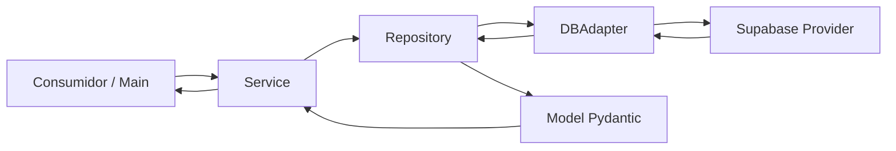

# Botanica

Proyecto Python con arquitectura por capas orientada a dominio para trabajar entidades botanicas y sus operaciones CRUD sobre Supabase.

## Objetivo del proyecto

Botanica separa claramente:

- Definicion de datos (models)
- Acceso a datos (repositories)
- Casos de uso y logica de aplicacion (services)
- Integracion con proveedor externo (adapters + providers)

Esta separacion permite escalar el codigo sin mezclar responsabilidades y facilita testing unitario por capa.

## Estructura primaria y responsabilidad por carpeta

### Raiz del proyecto

- `main.py`
	- Responsabilidad actual: punto de entrada simple para ejecutar un caso de uso (`UserService`).
	- Que agregar proximamente: un CLI real o API entrypoint (FastAPI/Flask) para exponer casos de uso.
	- Deber: no contener logica de acceso a BD ni transformaciones complejas; solo orquestacion.

- `requirements.txt`
	- Responsabilidad actual: dependencias runtime (`supabase`, `pydantic`, `python-dotenv`).
	- Que agregar proximamente: dependencias de desarrollo separadas o lockfile.
	- Deber: mantener versiones controladas y revisar compatibilidad.

- `install.sh` / `install.ps1`
	- Responsabilidad actual: bootstrap de entorno para Linux/PowerShell.
	- Que agregar proximamente: validaciones de version de Python y mensajes de diagnostico.
	- Deber: instalar de forma repetible y documentada.

### models/

- Responsabilidad actual:
	- Definir entidades de dominio y su esquema de datos (Pydantic) por subdominio.
	- Subcarpetas: `user/`, `taxonomy/`, `documentation/`, `botanical_attributes/`, `vector_tables/`, `queries/`.

- Que agregar proximamente:
	- Validaciones de dominio mas estrictas (rangos, formatos, enums).
	- Metodos de ayuda para transformaciones de datos entre capas.

- Deber de esta capa:
	- Ser independiente de infraestructura.
	- No ejecutar queries ni conocer tablas directamente.

### interfaces/

- Responsabilidad actual:
	- Definir contratos abstractos de repositorios y servicios:
		- `RepositoryInterface[T]`
		- `ServiceInterface[T]`

- Que agregar proximamente:
	- Contratos mas especificos para operaciones no-CRUD (ejemplo: busquedas semanticas, agregaciones).

- Deber de esta capa:
	- Estabilizar la API interna del proyecto.
	- Permitir reemplazar implementaciones sin romper consumidores.

### adapters/

- Responsabilidad actual:
	- Exponer `DBAdapter` como capa agnostica para operaciones CRUD.
	- Delegar en un proveedor concreto (`providers.Supabase`) sin acoplar repositorios al SDK externo.

- Que agregar proximamente:
	- Manejo unificado de errores de infraestructura.
	- Logging/telemetria de consultas.

- Deber de esta capa:
	- Traducir operaciones de dominio a operaciones de proveedor.
	- No contener reglas de negocio.

### providers/

- Responsabilidad actual:
	- Implementar cliente concreto de Supabase.
	- Gestionar inicializacion de cliente via variables de entorno (`SUPABASE_URL`, `SUPABASE_KEY`).
	- Aplicar filtros y ejecutar queries.

- Que agregar proximamente:
	- Retries, timeout y clasificacion de errores.
	- Posible soporte a otros proveedores.

- Deber de esta capa:
	- Encapsular SDK externo.
	- No exponer detalles internos al dominio.

### domain/

Contiene la logica de aplicacion dividida en dos grandes capas:

- `domain/repositories/`
	- Responsabilidad actual:
		- Implementaciones concretas de acceso a datos por entidad.
		- Uso de `BaseRepository` generico + conversion fila -> modelo con `_to_model`.
	- Que agregar proximamente:
		- Metodos especializados por repositorio (queries compuestas, filtros de negocio tecnicos).
	- Deber:
		- Depender de `adapters.DBAdapter`, no del SDK de Supabase directo.

- `domain/services/`
	- Responsabilidad actual:
		- Casos de uso de aplicacion.
		- Reutiliza `BaseRepositoryService` para CRUD base y agrega metodos especificos (ejemplo: `UserService.get_user_info`).
	- Que agregar proximamente:
		- Reglas de negocio transversales, validaciones de entrada, orquestacion entre multiples repositorios.
	- Deber:
		- Ser la capa donde vive la logica de aplicacion, no la infraestructura.

### tests/

- Responsabilidad actual:
	- Verificar contratos CRUD de repositorios y servicios.
	- Validar clases base e incluir pruebas de casos especificos (`UserService`).

- Que agregar proximamente:
	- Casos borde de validaciones Pydantic.
	- Pruebas de error handling en adapter/provider.
	- Pruebas de integracion con entorno de Supabase aislado.

- Deber:
	- Cubrir comportamiento observable, no detalles de implementacion fragiles.

## Responsabilidad de las interfaces

### RepositoryInterface

Define el contrato minimo para persistencia:

- `find_by_id`
- `find_one`
- `find_many`
- `create`
- `update`
- `delete`

Su responsabilidad es garantizar una firma consistente entre repositorios, facilitando polimorfismo, mocks y testabilidad.

### ServiceInterface

Define el contrato de la capa de servicios:

- `get_by_id`
- `get_one`
- `get_many`
- `create`
- `update`
- `delete`

Su responsabilidad es estandarizar la API de casos de uso, desacoplando consumidores de la implementacion concreta.

## Flujo de datos de la aplicacion

Flujo tipico de lectura:

1. Un consumidor invoca un servicio (por ejemplo `UserService.get_by_id`).
2. El servicio delega al repositorio correspondiente.
3. El repositorio llama al `DBAdapter` con tabla + filtros.
4. `DBAdapter` delega en `Supabase` provider.
5. Supabase devuelve filas (dict/list).
6. El repositorio transforma cada fila a modelo Pydantic.
7. El servicio retorna el modelo (o DTO derivado) al consumidor.



## Como se importan las cosas y uso de __init__.py

El proyecto usa un patron de exportacion por paquete:

1. Cada subpaquete importa sus clases internas en su `__init__.py`.
2. Define `__all__` para declarar explicitamente que simbolos exporta.
3. Los paquetes agregadores (como `models`, `domain.services`, `domain.repositories`, `domain`) re-exportan simbolos de niveles inferiores.

Esto permite imports limpios como:

```python
from models import User
from domain.services import UserService
from domain import repositories, services
```

### Beneficios de este enfoque

- Punto unico y consistente de import por capa.
- Menor acoplamiento a rutas internas de archivos.
- Descubrimiento dinamico simple con `__all__` (usado en tests para generar casos automaticamente).

### Deberes al agregar nuevos modulos

Cuando agregues una nueva entidad (ejemplo: `PlantCare`):

1. Crear modelo en su carpeta de `models`.
2. Exportarlo en el `__init__.py` del subpaquete y en `models/__init__.py`.
3. Crear repositorio y exportarlo en:
	 - `domain/repositories/<subdominio>/__init__.py`
	 - `domain/repositories/__init__.py`
4. Crear servicio y exportarlo en:
	 - `domain/services/<subdominio>/__init__.py`
	 - `domain/services/__init__.py`
5. Si aplica, re-exportarlo en `domain/__init__.py`.
6. Asegurar que quede cubierto por tests dinamicos y/o tests especificos.

## Convenciones recomendadas para crecimiento

- Mantener nombres de archivos en snake_case y clases en PascalCase.
- Evitar que `services` conozca detalles del SDK externo.
- Evitar que `repositories` implemente reglas de negocio complejas (eso va en `services`).
- Mantener `_to_model` como unico punto de mapeo fila -> entidad.
- Mantener contratos estables en `interfaces` antes de expandir implementaciones.

## Ejecucion de pruebas

```bash
python -m unittest discover -s tests -v
```

## Variables de entorno

Define estas variables para ejecutar contra Supabase:

- `SUPABASE_URL`
- `SUPABASE_KEY`

Puedes usar un archivo `.env` (cargado por `python-dotenv`).
